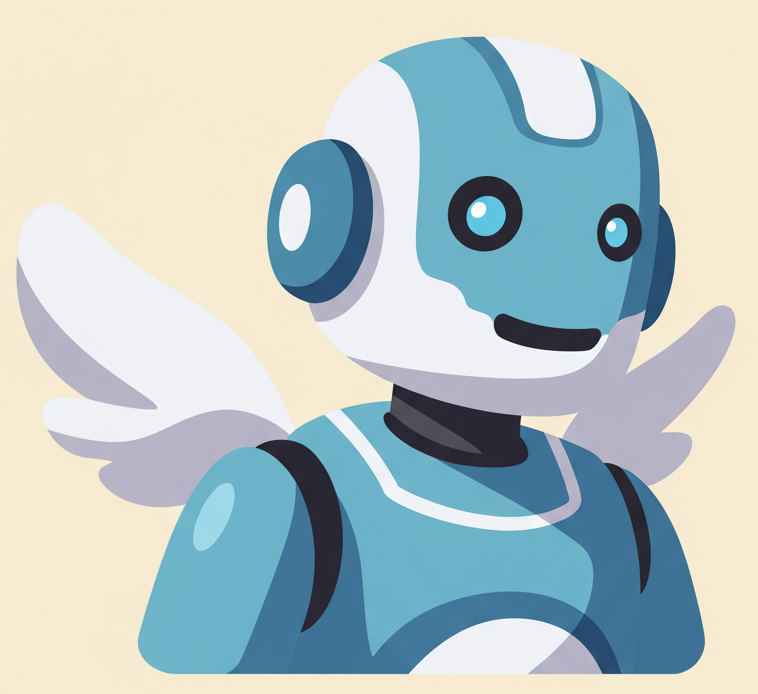

# Guardião do Bem-Estar

[](https://opensource.org/licenses/MIT)
[](https://www.python.org/downloads/)
[](https://flask.palletsprojects.com/)
[](https://ai.google.dev/models/gemini)
[](#)
[](#)
[](#)
<!-- Outros badges (opcional) -->

<p align="center">
  <!-- ✅ SUBSTITUA PELA URL DA SUA IMAGEM DE LOGO OU REMOVA ESTA TAG SE NÃO TIVER -->
  
  
</p>
<p align="center">
    Seu Companheiro Digital para uma Vida Mais Leve e Feliz!
</p>


**Este projeto é fruto da inspiradora Jornada da Imersão IA da Alura!** 🚀

Cansado da correria e buscando um momento para si? O **Guardião do Bem-Estar** é o seu novo aliado digital, um chatbot inteligente e empático criado para te ajudar a trilhar um caminho de maior equilíbrio físico e mental. Acreditamos que pequenas ações diárias podem florescer em grandes transformações, e nosso Guardião está aqui para te oferecer encorajamento, ferramentas práticas e um espaço seguro para o seu autocuidado.

---

## 🎯 Sobre o Projeto

O "Guardião do Bem-Estar" é mais que um chatbot: é um companheiro dedicado a auxiliar você na construção e manutenção de hábitos positivos. Desenvolvido com paixão durante a **Imersão IA da Alura**, este projeto explora o incrível potencial da Inteligência Artificial Generativa (com Google Gemini) para criar uma ferramenta que realmente entende e apoia suas necessidades de bem-estar emocional, sempre com um direcionamento ético e um toque de gamificação para tornar a jornada mais prazerosa.

Nossa missão é te ajudar a:
*   **Cultivar o autoconhecimento emocional.**
*   **Integrar micro-hábitos saudáveis** na sua rotina.
*   **Acessar ferramentas simples** para alívio do estresse e ansiedade.
*   **Lembrar da importância de celebrar** cada pequena vitória!

---

## ✨ O que o Guardião já pode fazer por você?

<p align="center">
  
  <!-- Ajuste a largura conforme necessário -->
</p>


Nosso Guardião está em constante aprendizado, mas já domina uma série de habilidades para te apoiar no dia a dia:

*   👋 **Boas-Vindas Acolhedora:** Assim que você chega, o Guardião te recebe com uma mensagem calorosa e o importante lembrete sobre os limites da ferramenta e onde buscar ajuda profissional.
*   💬 **Conversas Empáticas e Positivas:** Um diálogo leve e encorajador, focado em você.
*   💖 **Check-in Emocional Inteligente:**
    *   Compartilhe como está se sentindo através de uma **escala numérica (1-5)** ou com uma **palavra-chave** (o Guardião alterna as perguntas para variar!).
    *   Receba validação, **+5 pontos de bem-estar** por se conectar com suas emoções, e sugestões personalizadas de ações ou exercícios.
*   🧘 **Kit de Primeiros Socorros Emocionais (Guiado por RAG e LLM):**
    *   🌬️ **Respiração Profunda Guiada:** Para momentos de tensão, um guia passo a passo para 3 ciclos de respiração relaxante.
    *   👂 **Atenção Plena aos Sons:** Um exercício de mindfulness para ancorar no presente e acalmar a mente, utilizando scripts pré-definidos para consistência (RAG).
    *   🚶‍♂️ **Escaneamento Corporal Curto:** Uma prática guiada (via RAG) para maior consciência corporal e liberação de tensões.
    *   😊 **Técnica das "Três Coisas Boas":** Seja incentivado a listar três motivos de gratidão, com o Guardião reforçando positivamente essa prática.
*   🏆 **Gamificação Suave e Motivadora:**
    *   **Acumule Pontos de Bem-Estar!** Ganhe pontos ao completar check-ins, iniciar exercícios guiados e praticar a gratidão.
    *   O Guardião te informa sobre seus ganhos e seu total de pontos, celebrando seu progresso!
*   🌱 **Sugestão e Celebração de Micro-Hábitos:**
    *   Receba sugestões de pequenas ações positivas (ex: beber água, alongar-se) em momentos oportunos.
    *   Quando você relatar que completou uma ação, o Guardião celebra com você e te concede pontos!
*   🔗 **Abordagem Holística (Mente-Corpo):** O Guardião se esforça para explicar como ações físicas (como os micro-hábitos ou exercícios) também trazem benefícios para seu estado mental e emocional.
*   🎨 **Interface Agradável e Intuitiva:** Um design de chat limpo, com um fundo escuro que promove a tranquilidade e animações de digitação para uma experiência fluida.
*   🔒 **Persistência da Conversa:** Seu histórico de chat com o Guardião (incluindo o contexto para o modelo de IA) é mantido durante sua sessão.
*   🛡️ **Compromisso Inabalável com sua Segurança:**
    *   **DISCLAIMER FUNDAMENTAL:** O Guardião é uma ferramenta de suporte. **ELE NÃO SUBSTITUI ACONSELHAMENTO MÉDICO, PSICOLÓGICO OU PSIQUIÁTRICO PROFISSIONAL.**
    *   Em caso de expressões de sofrimento agudo ou risco, o Guardião **priorizará sua segurança**, interrompendo sugestões de hábitos e fornecendo imediatamente informações de contato para o **CVV (Centro de Valorização da Vida - Ligue 188 ou acesse cvv.org.br)** e outros serviços de apoio.

---

## 🚀 O Futuro é Brilhante: O que Vem por Aí!

A jornada de aprimoramento do Guardião continua! Temos planos empolgantes para o futuro:

*   **Gamificação Mais Envolvente:** Introdução de sequências por manter hábitos, possíveis emblemas ou reconhecimentos visuais para suas conquistas de bem-estar.
*   **RAG Expandido:** Utilizar a Recuperação Aumentada por Geração não apenas para os scripts de exercícios, mas também para fornecer informações ricas e baseadas em evidências sobre os benefícios de diferentes hábitos de bem-estar e para responder a perguntas mais gerais.
*   **Lembretes Amigáveis (Reativo):** Possibilitar que você peça ao Guardião para te lembrar de fazer pausas, beber água ou praticar um micro-hábito.
*   **Personalização Aprofundada:** Fazer com que o Guardião aprenda ainda mais com suas preferências para oferecer sugestões cada vez mais alinhadas.
*   **Refinamento Contínuo:** Melhorar constantemente os prompts, a naturalidade da conversa, a variedade de sugestões e a inteligência do Guardião.

---

## 🛠️ Tecnologias Utilizadas

Este projeto é uma sinergia de tecnologias modernas e focadas na experiência do usuário:

*   **Backend:** Python com **Flask**, um microframework web ágil e eficiente.
*   **Inteligência Artificial:** **Google Gemini** (modelo `gemini-1.5-flash-latest`), uma poderosa Large Language Model para conversas naturais, geração de conteúdo empático e processamento de instruções complexas.
*   **Frontend:** **HTML5, CSS3, e JavaScript (ES6+)** puro para uma interface de chat leve, responsiva e interativa.
*   **Gerenciamento de Sessão e Persistência Inicial:** **Flask Sessions** para armazenar o histórico da UI, o estado da conversa (flags de fluxo), o histórico da conversa do SDK Gemini e os pontos de gamificação do usuário.
*   **RAG (Retrieval Augmented Generation) - Fase Inicial:** Scripts para exercícios guiados armazenados em arquivos **JSON** e recuperados pelo backend para fornecer instruções consistentes e de alta qualidade através do LLM.
*   **Estrutura do Projeto:** Código modularizado no backend (`config.py`, módulos em `chatbot_logic/`) e no frontend (arquivos CSS e JS dedicados em `static/`) para melhor organização e manutenção.
*   **Controle de Versão:** **Git** e **GitHub**.
*   **Ambiente:** **Python**, gerenciamento de dependências com `pip` e `requirements.txt`, variáveis de ambiente com `python-dotenv`.

**Planejado para o Futuro (Tecnologias):**
*   **Persistência de Dados Avançada:** Exploração de bancos de dados (como SQLite ou PostgreSQL) para gamificação de longo prazo, histórico de usuário mais robusto e preferências.
*   **Expansão do RAG:** Uso de embeddings vetoriais e bancos de dados vetoriais para buscas semânticas em uma base de conhecimento maior.

---

## ⚙️ Como Rodar Localmente

1.  **Clone o repositório:**
    ```bash
    git clone https://github.com/AlanLiveHub/guardiao-do-bem-estar.git
    cd guardiao-do-bem-estar
    ```

2.  **Crie e ative um ambiente virtual (altamente recomendado):**
    ```bash
    python3 -m venv venv
    source venv/bin/activate
    ```
3.  **Instale as dependências:**
    ```bash
    pip install -r requirements.txt 
    ```
    *(Certifique-se de que seu `requirements.txt` está atualizado e contém pelo menos: `Flask`, `google-generativeai`, `python-dotenv`)*

4.  **Configure suas variáveis de ambiente:**
    *   Crie um arquivo chamado `.env` na raiz do projeto.
    *   Adicione sua chave da API Gemini:
        ```env
        GEMINI_API_KEY=SUA_CHAVE_API_GEMINI_AQUI
        ```
5.  **Execute o aplicativo Flask:**
    ```bash
    python3 app.py
    ```
6.  Abra seu navegador e acesse `http://127.0.0.1:5000/`.

---

## 💖 Junte-se a Nós Nesta Jornada!

O "Guardião do Bem-Estar" é mais que um chatbot; é um convite para você investir no seu bem mais precioso: você mesmo(a). Estamos empolgados para continuar desenvolvendo esta ferramenta e esperamos que ela possa trazer mais leveza, consciência e alegria para o seu dia a dia.

<!-- **Fique ligado para mais atualizações e sinta-se à vontade para experimentar o Guardião!**
*(✅ Se o projeto estiver hospedado publicamente, adicione o link aqui. Ex: [Experimente o Guardião do Bem-Estar Agora!](URL_DO_SEU_APP_HOSPEDADO))* -->

---
<!-- 
## 🤝 Como Contribuir (Opcional - Adicione se quiser)

Estamos abertos a colaborações e ideias! Se você gostaria de contribuir:
1. Faça um Fork do projeto.
2. Crie uma Branch para sua Feature (`git checkout -b feature/MinhaNovaFeature`).
3. Faça Commit das suas alterações (`git commit -m 'Adiciona MinhaNovaFeature'`).
4. Faça Push para a Branch (`git push origin feature/MinhaNovaFeature`).
5. Abra um Pull Request com uma descrição clara das suas mudanças.

Sinta-se à vontade também para abrir Issues para reportar bugs ou sugerir novas funcionalidades!
-->